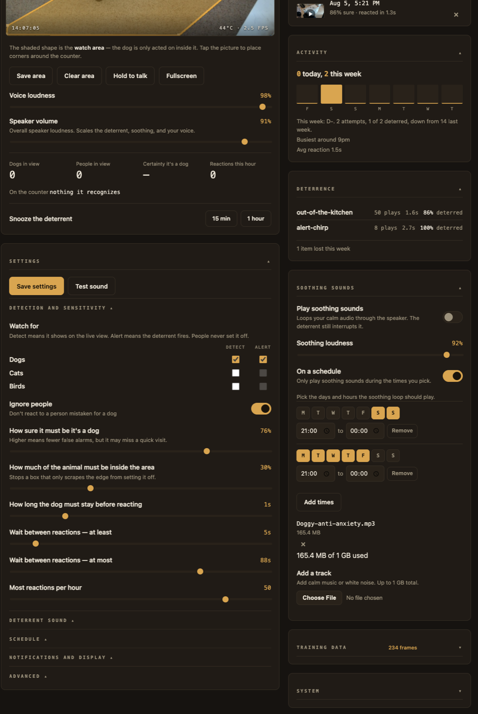
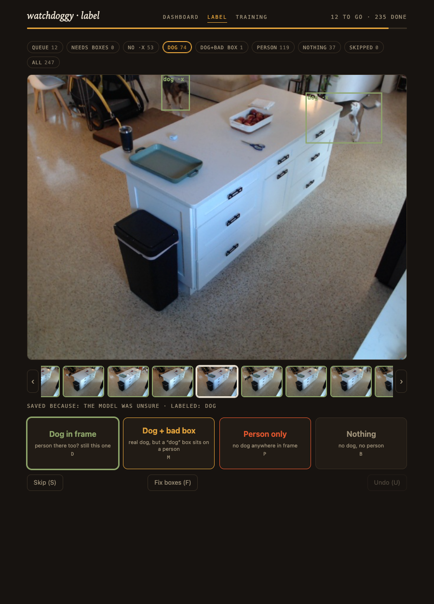
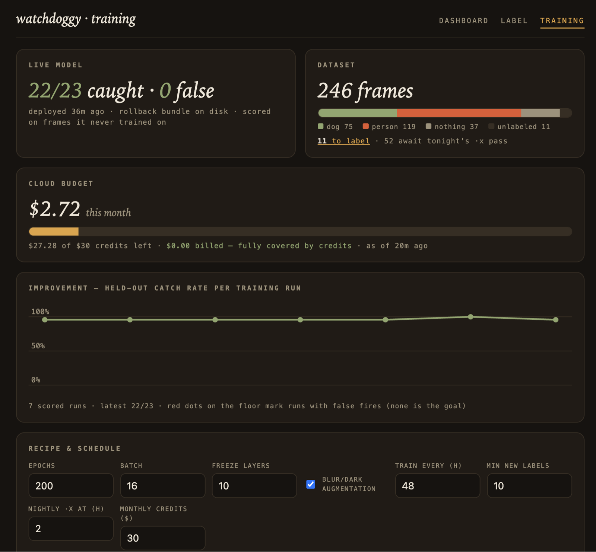

# The owner's manual

Everything about living with a Counter Watch appliance: the dashboard, the
self-training loop, the training console, and the machinery that keeps the
device current without you. Setup and deployment are in the
[README](README.md); the code layout is in [ARCHITECTURE.md](ARCHITECTURE.md).

## Using the dashboard

Open `http://<pi-host>:8000` from any device on your network.

- The status pill shows Watching, Dog spotted, or Cooling down.
- Draw the watch area by tapping corners around the counter on the live view,
  then Save area.
- Simple settings cover how sure it must be, how long the dog must linger,
  the wait between reactions, the hourly cap, and Ignore people.
- Advanced holds the detection-window and person-matching knobs. System shows
  temperature, power, and speed.
- The catch log shows each alarm with its clip; a one-tap "Not a dog" button
  turns any false alarm straight into training data and a permanent exam
  question.
- **Label** is the annotation tool; **Training** is the training console,
  including the software version, the auto-update toggle, and an Update now
  button.

Soothing sounds loops your own calm audio, music or white noise, through the
speaker while it watches. Upload tracks from the Soothing sounds card, up to
1 GB in total, then turn it on. The deterrent always takes priority, so an
alarm interrupts the music the moment a dog is confirmed and the loop resumes
on its own a little later.



## HTTPS (for push-to-talk and notifications)

Browsers only allow the microphone and notifications on secure pages, so
those features need the dashboard served over https. One script sets it up:

```sh
./scripts/setup-https.sh <user@host>
```

It creates a "watchdoggy home CA" on the Pi, issues the dashboard a
certificate signed by it, and restarts the service. The CA never leaves your
Pi and nothing talks to the internet.

Then open the same address you always use, `http://<pi-host>:8000`, on each
device. The page checks whether that device already trusts the home
certificate. If it does, it sends you straight to the secure dashboard. If it
does not, it hands you the certificate and the one-time steps to trust it (it
detects your platform and offers the right file):

- iPhone/iPad: open the profile, install it in Settings, then Settings >
  General > About > Certificate Trust Settings > enable it
- Mac: open the file in Keychain Access, set Trust to Always
- Android: Settings > Security > Install a certificate > CA certificate

The page rechecks on its own, so as soon as the device trusts the certificate
it moves you along. After that the padlock is normal on every visit and your
old bookmark keeps working. The certificate lasts about two years; re-run the
script to renew it, and your devices keep working without any new steps. The
secure dashboard also has a direct address, `https://<pi-host>:8443`, once a
device is trusted.

## Configuration

Structural config (camera, ports, paths, TLS) is set with `DOGGY_*` environment
variables (see `.env.example`). Everything the dashboard changes live lives in
`settings.json` next to it, written by the app; every change is appended to
`settings-changes.jsonl` (when, which key, old, new, and the client that made
it) and shown by `GET /api/settings/history`. The first start after upgrading
migrates the tunables out of `.env` automatically.
Live-tunable params are also editable from the dashboard and persist the
moment you change them, so the appliance's own self-update restarts never
revert a toggle. Structural params (camera, model, audio backend) need a
restart. Training recipe, schedule, and the auto-update toggle live on the
Training page.

## The self-training loop

The stock COCO-trained model has never seen *your* kitchen from *your* camera
angle. Ours kept mistaking a person loading the dishwasher for a dog. The fix
is a closed loop that lives on the appliance:

> **Privacy:** this loop is optional and only runs after cloud training is
> enabled ([Pi guide, step 6](docs/pi/README.md#6-cloud-training-and-self-updates-optional)).
> Live detection stays local either way. With it on, the frames saved in step 1,
> including frames with people in them, are uploaded to the Modal volume in
> your own account for labeling and training.

1. **Capture.** The detector saves interesting frames as they happen: every
   alarm (plus the raw seconds before it), borderline detections, suppressed
   boxes, person activity, periodic background shots, and "flicker" moments
   where the model keeps changing its mind about the same scene, which is a
   stronger uncertainty signal than any single score. A brightness failsafe
   skips lights-off frames, and a perceptual-hash check drops near-duplicates
   of dogless scenes, so neither darkness nor a long cooking session can
   flood the queue. Frames containing a dog are never thinned: on a fixed
   camera the unchanging background dominates the hash, so distinct dog
   moments look alike to it. Storage is
   capped, and when the cap is reached the oldest unlabeled frames go first;
   labeled frames are never deleted, the appliance warns instead.
2. **Machine labeling, nightly.** A cloud pass runs every night: a large
   model (yolo26x) draws `·x` boxes for every new frame, and a **two-model
   jury** (the deployed fine-tune plus the big model) auto-labels the frames
   it can vouch for. The jury's thresholds are not guesses: they are
   backtested against the full human-labeled corpus with the current champion
   as juror, and re-audited when the champion changes. In the latest backtest
   the shipped rules mislabel about 0.1% of dog frames and fabricate none,
   while clearing about a third of a fresh queue per pass. The jury also
   remembers: frames it declined stay declined until the model or the rules
   change, so no pass pays to re-judge the same undecidable frames. It also
   **audits existing labels**: when both models strongly contradict a human
   verdict, the frame is flagged Disputed for re-review. Anything the jury is
   unsure about goes to the human.
3. **Human labeling, only the disagreements.** The `/label` page is a fixed
   stage with a filmstrip and filter chips: the Queue (what the jury couldn't
   settle), Disputed, Auto (spot-check the machine's work; one tap overrules
   forever), and Needs-boxes finders. Verdicts are one keystroke; a full box
   editor handles frames needing hand-drawn truth, which then outranks every
   model. In training, your labels count double the jury's.

   
4. **Train.** Every couple of days (configurable), the trainer sends one job
   to a Modal cloud GPU: label fusion, near-duplicate pruning of dogless
   frames, blur/dark augmentation, training (GPU tier and batch size
   auto-scale with dataset size), frame-level evaluation scored the way the
   alarm actually fires, NCNN export, and a robustness stress test (blur,
   darkness, overexposure, compression, camera shift). Auto-labeled frames
   train but never enter the exam.
5. **Gate.** Challenger and incumbent sit the **identical, 100%
   human-verified held-out exam**, judged at the appliance's actual runtime
   threshold, and **the best model wins**: fewest total errors (missed dogs
   plus false fires), with false fires as tie-breaker and always-visible
   indicator. Every false alarm you ever flagged from the catch log is a
   permanent exam member, so a mistake that reached you keeps being tested
   forever. Reports break the exam into failure-mode slices (dark scenes,
   person present, small or edge-of-frame dogs, fire-origin frames) for both
   models side by side, and include confidence-calibration diagnostics, so an
   improving average can't hide a regressing corner. The previous model is
   kept on disk for instant rollback.
6. **Repeat.** Every mistake it makes becomes training data against it, and
   the exam grows harder as the dataset grows.

Your only job is a few minutes of arbitration on the Label page now and then.
Everything else (nightly prelabels, consensus auto-labeling, label audits,
scheduled training, evaluation, gated deployment) happens on its own.

## The training console

The `/training` page is the console: the live model's scorecard (scored at
the threshold the detector actually runs with), dataset composition, real
cloud spend against your credit allowance, an improvement chart across runs,
the cloud run's stages and log streaming live while it works, recipe and
schedule knobs, and every run's full report (threshold curves, gate
comparison, robustness table, failure-mode slices).



Billing is pulled straight from Modal and every run records its true cost.
The monthly credits setting is a hard stop: once spend reaches it, or
anything has been billed beyond credits, the trainer refuses to start cloud
jobs and says so, both on the budget card and in the refused job's history
entry. Self-updates still run (they come from GitHub, not Modal), and cloud
jobs resume by themselves when the billing cycle resets.

## It maintains itself

The same sandboxed trainer that talks to the cloud GPU also keeps the
appliance itself current:

- **Self-updates from GitHub releases.** Once a day (a dashboard toggle, on
  by default) it checks the repo's latest release over plain unauthenticated
  HTTPS; there is no GitHub credential anywhere on the device. A newer tag
  becomes a job in the same queue as training runs: download, verify,
  snapshot the current code, install through a fixed-path root helper,
  restart, then health-poll the detector for two minutes. If the appliance
  doesn't come back healthy it rolls itself back. Releases that change
  dependencies are refused with a note on the dashboard, because the offline
  appliance cannot install packages; those need one deploy from a
  workstation.
- **Keeps its own clock.** The Pi has no battery clock and the firewall
  blocks public NTP, so each trainer pass syncs time from an HTTPS Date
  header (the htpdate trick) through a bounds-checked root helper. On its
  first day it caught the clock 52 seconds off.
- **Snapshots state before every change.** Each self-update first copies the
  dataset sidecars, job history, models, and config aside on the Pi (newest
  two snapshots kept). `scripts/pull-backup.sh` pulls the same state to your
  workstation in one command, and the cloud volume mirrors the dataset with
  every training run, so labels exist in three places.

## Privacy details

Live detection stays local. Optional cloud training sends saved camera frames
to your own cloud account.

- The detector service has no internet access, enforced by an nftables egress
  firewall (`scripts/harden-pi.sh`, LAN only). The live stream is only served
  on your LAN.
- Cloud training is opt-in and runs as a separate `trainer` user. A per-UID
  firewall exception lets only that user reach the internet (DNS + HTTPS).
  When enabled, every frame the Pi saves for training is uploaded to your
  Modal volume, including frames with people in them. The trainer also
  contacts `api.github.com` for release checks and the time.
- To stop uploads, disable `doggy-trainer.timer`. Already-uploaded frames stay
  in your Modal volume until you delete them.
- Skip `setup-pi-trainer.sh` and nothing leaves the Pi. You can still run the
  same training pipeline manually from a workstation
  (`scripts/train_kitchen_model.py`, including a 10-config hyperparameter
  sweep with `--sweep`).
