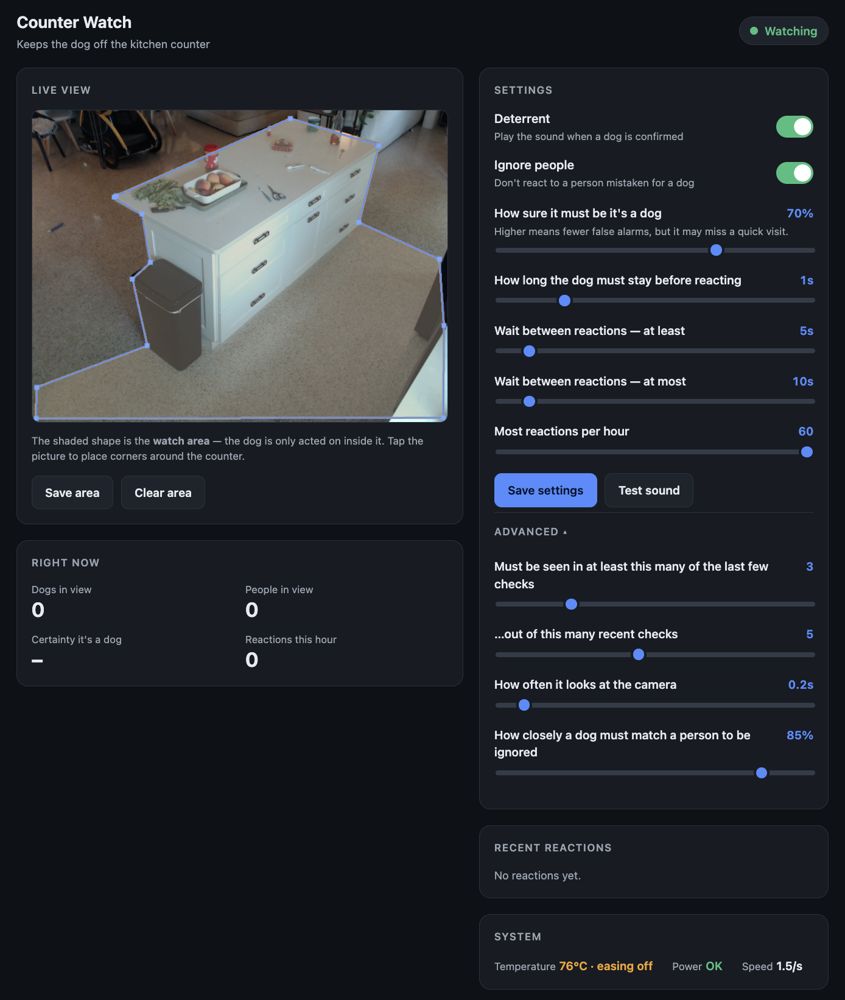

# watchdoggy

Counter Watch is a ~$62 Raspberry Pi appliance that watches your kitchen counter, spots the dog when it jumps up, and plays a deterrent sound. It only reacts inside an area you draw, ignores people, and manages its own temperature.

It runs entirely on the device with no internet access. The model downloads once during setup, then the Pi is firewalled to your local network and never talks to the outside. Your camera feed stays on your network.



## What it does

- Detects dogs with YOLO running locally on the Pi's CPU (via NCNN). No cloud vision API.
- Only acts on dogs inside a watch area you draw on the live view.
- Ignores people, so someone mistaken for a dog won't set it off.
- Plays a deterrent sound through a Bluetooth or USB speaker, with cooldowns and an hourly cap.
- Scales its work rate with CPU temperature so a fanless Pi doesn't throttle.
- Serves a plain-language dashboard on your network for the live view and settings.

## Fully local

- All detection runs on the device. No cloud, no account, no subscription.
- No internet needed to run. The model is downloaded once at setup, then it works offline.
- `scripts/harden-pi.sh` installs an nftables firewall that blocks outbound traffic except your local network, so it can't reach the internet.
- The dashboard is served only on your LAN. Nothing is uploaded or stored anywhere else.
- Ultralytics telemetry is turned off during setup.

## Hardware (~$62)

| Part | Price |
|---|---|
| Raspberry Pi 4 Model B | $35 |
| Aluminum heatsink case | $12 |
| 1080p USB webcam | $15 |
| Total | ~$62 |

Plus any Bluetooth or USB speaker you already have for the sound (this build uses a JBL Go).

## How it works

```
USB webcam -> capture thread -> YOLO (NCNN, on-CPU)
           -> watch-area filter -> person suppression
           -> M-of-N + confirm-timer trigger -> safety limits (cooldown, hourly cap)
           -> deterrent sound
```

A FastAPI app streams the annotated view over MJPEG and exposes the live-tunable settings. A governor reads the CPU temperature each loop and paces detection to keep the board below its throttle point.

The package layout and the design patterns behind it are documented in [ARCHITECTURE.md](ARCHITECTURE.md).

## Quick start (dev, on a Mac)

```sh
uv sync
cp .env.example .env          # set DOGGY_CAMERA_INDEX for your webcam
uv run yolo export model=yolo26n.pt format=ncnn   # downloads yolo26n.pt
# drop at least one sound clip into sounds/
uv run doggy                  # dashboard at http://127.0.0.1:8000
```

Grant your terminal camera permission (System Settings, Privacy, Camera), or OpenCV returns empty frames with no error.

## Deploy to a Raspberry Pi

```sh
./scripts/deploy-to-pi.sh <user@host>
```

This syncs the code, installs dependencies with `uv`, downloads and NCNN-exports the model for ARM, writes a Pi `.env`, and installs a systemd service that runs on boot.

Optional:

- `scripts/setup-bt-speaker.sh` sets up a Bluetooth speaker with hands-free auto-reconnect (PipeWire).
- `scripts/harden-pi.sh` locks it down with a LAN-only egress firewall and key-only SSH.

## Using the dashboard

Open `http://<pi-host>:8000` from any device on your network.

- The status pill shows Watching, Dog spotted, or Cooling down.
- Draw the watch area by tapping corners around the counter on the live view, then Save area.
- Simple settings cover how sure it must be, how long the dog must linger, the wait between reactions, the hourly cap, and Ignore people.
- Advanced holds the detection-window and person-matching knobs. System shows temperature, power, and speed.
- Test sound plays the deterrent. Save settings writes to the Pi's `.env`.

Soothing sounds loops your own calm audio, music or white noise, through the speaker while it watches. Upload tracks from the Soothing sounds card, up to 1 GB in total, then turn it on. The deterrent always takes priority, so an alarm interrupts the music the moment a dog is confirmed and the loop resumes on its own a little later.

### HTTPS (for push-to-talk and notifications)

Browsers only allow the microphone and notifications on secure pages, so those features need the dashboard served over https. One script sets it up:

```sh
./scripts/setup-https.sh doggy@doggypi.local
```

It creates a "watchdoggy home CA" on the Pi, issues the dashboard a certificate signed by it, and restarts the service. The CA never leaves your Pi and nothing talks to the internet.

Then just open the same address you always use, `http://<pi-host>:8000`, on each device. The page checks whether that device already trusts the home certificate. If it does, it sends you straight to the secure dashboard. If it does not, it hands you the certificate and the one-time steps to trust it (it detects your platform and offers the right file):

- iPhone/iPad: open the profile, install it in Settings, then Settings > General > About > Certificate Trust Settings > enable it
- Mac: open the file in Keychain Access, set Trust to Always
- Android: Settings > Security > Install a certificate > CA certificate

The page rechecks on its own, so as soon as the device trusts the certificate it moves you along. After that the padlock is normal on every visit and your old bookmark keeps working. The certificate lasts about two years; re-run the script to renew it, and your devices keep working without any new steps. The secure dashboard also has a direct address, `https://<pi-host>:8443`, once a device is trusted.

## Configuration

Config is set with `DOGGY_*` environment variables (see `.env.example`). Live-tunable params are also editable from the dashboard. Structural params (camera, model, audio backend) need a restart.

## Tests

```sh
uv run pytest -m "not slow"    # fast suite, no hardware or weights
uv run pytest -m slow          # detector test (needs the model and fixtures)
```

## License

AGPL-3.0-or-later, matching YOLO26n.
