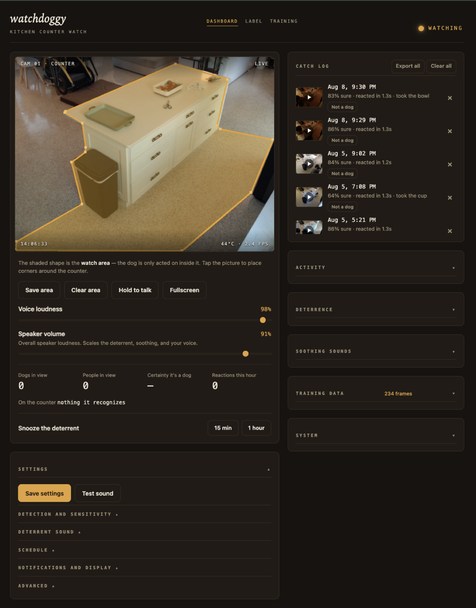
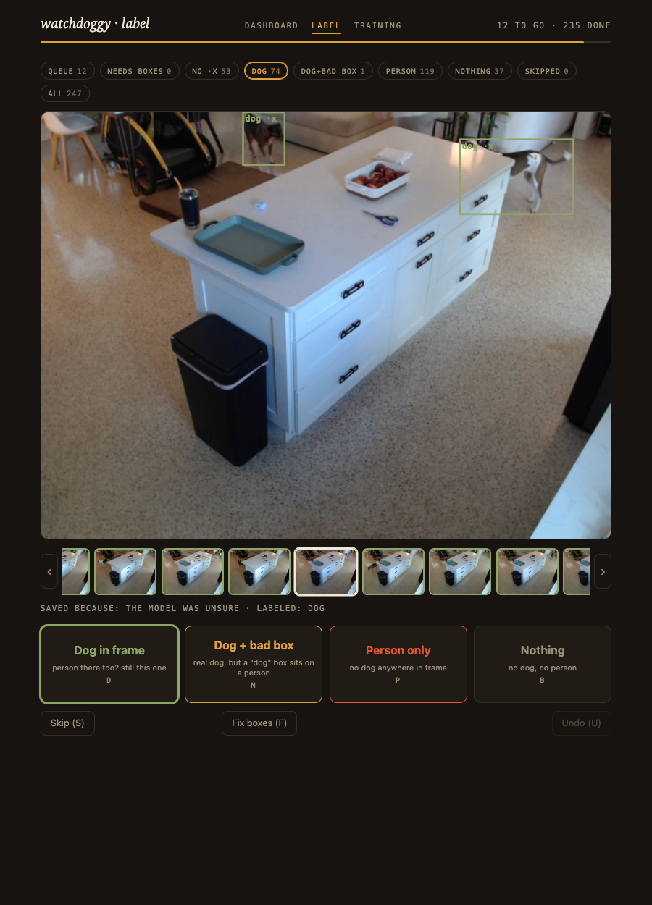
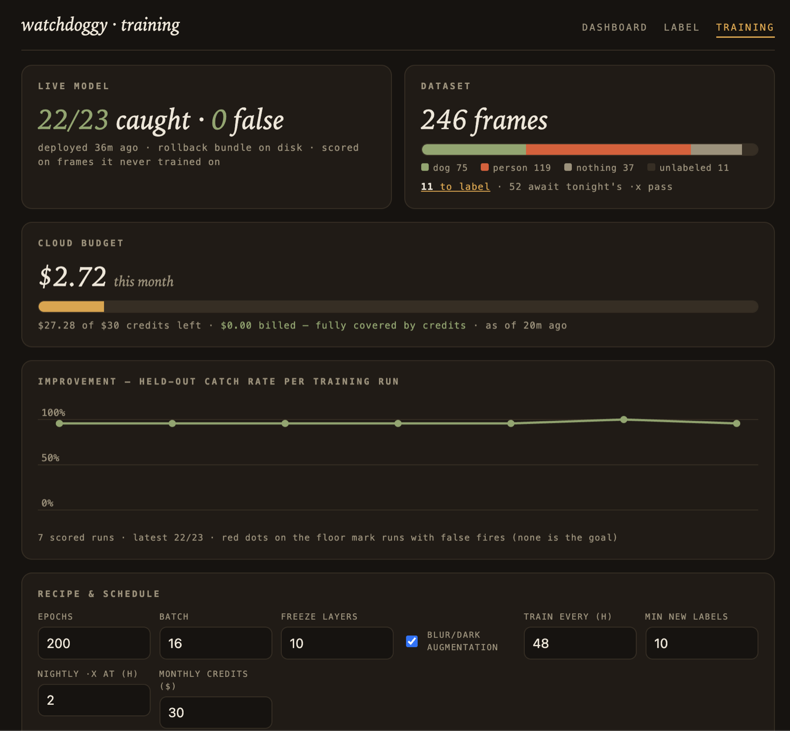
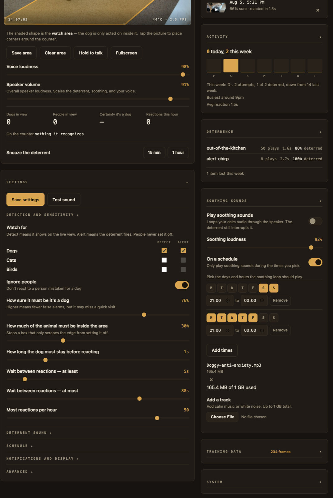

# watchdoggy

Counter Watch is a ~$62 Raspberry Pi appliance that watches your kitchen counter, spots the dog when it jumps up, and plays a deterrent sound. It only reacts inside an area you draw, ignores people, and manages its own temperature. It also **retrains its own vision model on the frames it captures**, so it gets better at your kitchen, your light, and your dog, week after week. Since v1.0.0 it updates its own software too: tag a release on GitHub and every appliance installs it, health-checks itself, and rolls back if anything looks wrong.

Detection runs entirely on the device. The camera feed never leaves your network. The only thing that ever touches the internet, and only if you enable it, is a sandboxed trainer that sends training jobs to your own private cloud GPU account and checks GitHub for releases.



## What it does

- Detects dogs with a YOLO model running locally on the Pi's CPU (via NCNN). No cloud vision API.
- Only acts on dogs inside a watch area you draw on the live view.
- Ignores people, including a size/geometry filter for the classic failure where a bent-over person reads as a "dog".
- Plays a deterrent sound through a Bluetooth or USB speaker, with cooldowns and an hourly cap.
- Keeps a catch log with a snapshot and a short clip of every alarm, viewable on the dashboard.
- Loops your own calm audio (soothing sounds) while it watches; the deterrent always interrupts and the music resumes on its own.
- Scales its work rate with CPU temperature so a fanless Pi doesn't throttle.
- Captures training frames from its own mistakes and edge cases, and **improves itself** (below).
- Updates itself from GitHub releases, keeps its clock synced, and snapshots its own state before every change (below).
- Serves a plain-language dashboard on your network: Dashboard, Label, and Training pages.

## It trains itself

The stock COCO-trained model has never seen *your* kitchen from *your* camera angle. Ours kept mistaking a person loading the dishwasher for a dog. The fix is a closed loop that lives on the appliance:

1. **Capture.** The detector saves interesting frames as they happen: every alarm (plus the raw seconds before it), borderline detections, suppressed boxes, person activity, periodic background shots, and "flicker" moments where the model keeps changing its mind about the same scene, which is a stronger uncertainty signal than any single score. A brightness failsafe skips lights-off frames, and a perceptual-hash check drops near-duplicates of dogless scenes, so neither darkness nor a long cooking session can flood the queue. Frames containing a dog are never thinned: on a fixed camera the unchanging background dominates the hash, so distinct dog moments look alike to it, a lesson learned by measurement.
2. **Machine labeling, nightly.** A cloud pass runs every night: a large model (yolo26x) draws `·x` boxes for every new frame, and a **two-model jury** (the deployed fine-tune plus the big model) auto-labels the frames it can vouch for. The jury's thresholds are not guesses: they are backtested against the full human-labeled corpus with the current champion as juror, and re-audited when the champion changes. In the latest backtest the shipped rules mislabel about 0.1% of dog frames and fabricate none, while clearing about a third of a fresh queue per pass. The jury also **audits existing labels**: when both models strongly contradict a human verdict, the frame is flagged Disputed for re-review. Anything the jury is unsure about goes to the human.
3. **Human labeling, only the disagreements.** The `/label` page is a fixed stage with a filmstrip and filter chips: the Queue (what the jury couldn't settle), Disputed, Auto (spot-check the machine's work; one tap overrules forever), and Needs-boxes finders. Verdicts are one keystroke; a full box editor handles frames needing hand-drawn truth, which then outranks every model. In training, your labels also weigh double the jury's, so the human voice stays the loudest as the machine-labeled share grows.

   
4. **Train.** Every couple of days (configurable), the trainer sends one job to a Modal cloud GPU: label fusion, near-duplicate pruning of dogless frames, blur/dark augmentation, training (GPU tier and batch size auto-scale with dataset size), frame-level evaluation scored the way the alarm actually fires, NCNN export, and a robustness stress test (blur, darkness, overexposure, compression, camera shift). Auto-labeled frames train but never enter the exam.
5. **Gate.** Challenger and incumbent sit the **identical, 100% human-verified held-out exam**, judged at the appliance's actual runtime threshold, and **the best model wins**: fewest total errors (missed dogs plus false fires), with false fires as tie-breaker and always-visible indicator. Every false alarm you ever flagged from the catch log is a permanent exam member, so a mistake that reached you keeps being tested forever. Reports break the exam into failure-mode slices (dark scenes, person present, small or edge-of-frame dogs, fire-origin frames) for both models side by side, and include confidence-calibration diagnostics, so an improving average can't hide a regressing corner. The previous model is kept on disk for instant rollback.
6. **Repeat.** Every mistake it makes becomes training data against it, and the exam grows harder as the dataset grows.

Your only job is a few minutes of arbitration on the Label page now and then. Everything else (nightly prelabels, consensus auto-labeling, label audits, scheduled training, evaluation, gated deployment) happens on its own.

The `/training` page is the console: the live model's scorecard, dataset composition, real cloud spend against your credit allowance (billing pulled from Modal; every run records its true cost), an improvement chart across runs, the cloud run's stages and log streaming live while it works, recipe and schedule knobs, and every run's full report (threshold curves, gate comparison, robustness table, failure-mode slices).



In this kitchen the loop's first day took the model from 15/61 dog moments caught with 5 false alarms (stock COCO weights) to 90%+ catch rates, measured on the exported bundle the Pi actually runs, on held-out frames it never trained on. The exam itself keeps growing as frames get labeled, so the bar rises with the model.

## It maintains itself

The same sandboxed trainer that talks to the cloud GPU also keeps the appliance itself current:

- **Self-updates from GitHub releases.** Once a day (a dashboard toggle, on by default) it checks the repo's latest release over plain unauthenticated HTTPS; there is no GitHub credential anywhere on the device. A newer tag becomes a job in the same queue as training runs: download, verify, snapshot the current code, install through a fixed-path root helper, restart, then health-poll the detector for two minutes. If the appliance doesn't come back healthy it rolls itself back. Releases that change dependencies are refused with a note on the dashboard, because the offline appliance cannot install packages; those need one deploy from a workstation.
- **Keeps its own clock.** The Pi has no battery clock and the firewall blocks public NTP, so each trainer pass syncs time from an HTTPS Date header (the htpdate trick) through a bounds-checked root helper. On its first day it caught the clock 52 seconds off.
- **Snapshots state before every change.** Each self-update first copies the dataset, job history, models, and config aside on the Pi (newest two snapshots kept). `scripts/pull-backup.sh` pulls the same state to your workstation in one command, and the cloud volume mirrors the dataset with every training run, so the labels you spent evenings on exist in three places.

## Privacy model

- The **detector service has no internet access, enforced by the firewall**, not by promises. `scripts/harden-pi.sh` sets an nftables egress lockdown (LAN only).
- Cloud training is **opt-in** and runs as a separate `trainer` user. A per-UID firewall exception lets *only that user* reach the internet (DNS + HTTPS), verified blocked for everything else. Frames go to your own private Modal volume and nowhere else.
- Skip `setup-pi-trainer.sh` and the appliance is 100% offline; you can still run the same training pipeline manually from a workstation (`scripts/train_kitchen_model.py`, including a 10-config hyperparameter sweep with `--sweep`).

## Hardware (~$62)

| Part | Price |
|---|---|
| Raspberry Pi 4 Model B | $35 |
| Aluminum heatsink case | $12 |
| 1080p USB webcam | $15 |
| Total | ~$62 |

Plus any Bluetooth or USB speaker you already have for the sound (this build uses a JBL Go), and optionally a Modal account for cloud training (a full training run costs well under two dollars).

## How it works

```
USB webcam -> capture thread -> YOLO (NCNN, in a dedicated inference process)
           -> watch-area filter -> person suppression -> oversize filter
           -> M-of-N + confirm-timer trigger -> safety limits (cooldown, hourly cap)
           -> deterrent sound + catch log + clip + training-frame capture
```

A FastAPI app streams the annotated view over MJPEG and exposes the live-tunable settings. A governor reads the CPU temperature each loop and paces detection to keep the board below its throttle point. A reaction hub fans each confirmed catch out to the sound, the event log, the clip recorder, and the dataset capturer.

Inference runs in its own child process. The reason is a hard-won one: the NCNN python binding holds the GIL for the entire forward pass, so with in-process inference every web request froze for the duration of every inference and dashboard pages took seconds. With the model in its own process, and an mtime-cached index over the dataset's sidecar files, every page and API call answers in tens of milliseconds while detection runs at full rate. A crashed inference worker is replaced automatically and the missed frame is absorbed by the trigger logic.

The training side: the web UI writes job files to a queue directory; the `trainer` user's systemd timer picks them up (or synthesizes them on schedule: nightly labeling, training every couple of days, a daily release check), runs `scripts/modal_pipeline.py`, the whole pipeline in one cloud container, and applies gated results through fixed-path root helpers. The pipeline itself is the `scripts/kitchen_training/` package, path-configurable so the identical code runs on a workstation or in the cloud.

The package layout and the design patterns behind it are documented in [ARCHITECTURE.md](ARCHITECTURE.md). House rules across the codebase: no file over 200 lines, no `else` blocks, no nested loops.

## Quick start (dev, on a Mac)

```sh
uv sync
cp .env.example .env          # set DOGGY_CAMERA_INDEX for your webcam
uv run yolo export model=yolo26n.pt format=ncnn   # downloads yolo26n.pt
# drop at least one sound clip into sounds/
uv run doggy                  # dashboard at http://127.0.0.1:8000
```

Grant your terminal camera permission (System Settings, Privacy, Camera), or OpenCV returns empty frames with no error.

## Deploy to a Raspberry Pi

```sh
./scripts/deploy-to-pi.sh <user@host>
```

This syncs the code, installs dependencies with `uv`, downloads and NCNN-exports the model for ARM, writes a Pi `.env`, and installs a systemd service that runs on boot. After the first full deploy, day-to-day updates arrive by themselves: tag a release and the appliance takes it from there.

Optional:

- `scripts/setup-bt-speaker.sh` sets up a Bluetooth speaker with hands-free auto-reconnect (PipeWire).
- `scripts/harden-pi.sh` locks it down with a LAN-only egress firewall and key-only SSH.
- `scripts/setup-https.sh` gives the dashboard a padlock via a home CA (needed for push-to-talk and notifications).
- `scripts/setup-pi-trainer.sh` enables autonomous cloud training and self-updates: creates the sandboxed `trainer` user, the per-UID firewall exception, the Modal client, the root helpers, and the schedule. Needs a Modal account (`modal token` on the machine you run it from).

## Using the dashboard

Open `http://<pi-host>:8000` from any device on your network.

- The status pill shows Watching, Dog spotted, or Cooling down.
- Draw the watch area by tapping corners around the counter on the live view, then Save area.
- Simple settings cover how sure it must be, how long the dog must linger, the wait between reactions, the hourly cap, and Ignore people.
- Advanced holds the detection-window and person-matching knobs. System shows temperature, power, and speed.
- The catch log shows each alarm with its clip; a one-tap "Not a dog" button turns any false alarm straight into training data and a permanent exam question.
- **Label** is the annotation tool; **Training** is the training console, including the software version, the auto-update toggle, and an Update now button.

Soothing sounds loops your own calm audio, music or white noise, through the speaker while it watches. Upload tracks from the Soothing sounds card, up to 1 GB in total, then turn it on. The deterrent always takes priority, so an alarm interrupts the music the moment a dog is confirmed and the loop resumes on its own a little later.



### HTTPS (for push-to-talk and notifications)

Browsers only allow the microphone and notifications on secure pages, so those features need the dashboard served over https. One script sets it up:

```sh
./scripts/setup-https.sh <user@host>
```

It creates a "watchdoggy home CA" on the Pi, issues the dashboard a certificate signed by it, and restarts the service. The CA never leaves your Pi and nothing talks to the internet.

Then just open the same address you always use, `http://<pi-host>:8000`, on each device. The page checks whether that device already trusts the home certificate. If it does, it sends you straight to the secure dashboard. If it does not, it hands you the certificate and the one-time steps to trust it (it detects your platform and offers the right file):

- iPhone/iPad: open the profile, install it in Settings, then Settings > General > About > Certificate Trust Settings > enable it
- Mac: open the file in Keychain Access, set Trust to Always
- Android: Settings > Security > Install a certificate > CA certificate

The page rechecks on its own, so as soon as the device trusts the certificate it moves you along. After that the padlock is normal on every visit and your old bookmark keeps working. The certificate lasts about two years; re-run the script to renew it, and your devices keep working without any new steps. The secure dashboard also has a direct address, `https://<pi-host>:8443`, once a device is trusted.

## Configuration

Config is set with `DOGGY_*` environment variables (see `.env.example`). Live-tunable params are also editable from the dashboard and persist the moment you change them, so the appliance's own self-update restarts never revert a toggle. Structural params (camera, model, audio backend) need a restart. Training recipe, schedule, and the auto-update toggle live on the Training page.

## Tests

```sh
uv run pytest -m "not slow"    # fast suite (~370 tests), no hardware or weights
uv run pytest -m slow          # detector test (needs the model and fixtures)
```

## License

The code in this repository is MIT licensed.

Two dependency notes, stated plainly. First, the project depends on the
Ultralytics YOLO library, which is AGPL-3.0: none of its code lives in this
repository, but installing the dependencies and running the combined work
puts that combination under AGPL terms (or an Ultralytics commercial
license). Second, the YOLO26 weights and any model you fine-tune from them
inherit Ultralytics' licensing; the MIT grant here covers this project's
code, not the models it trains.
