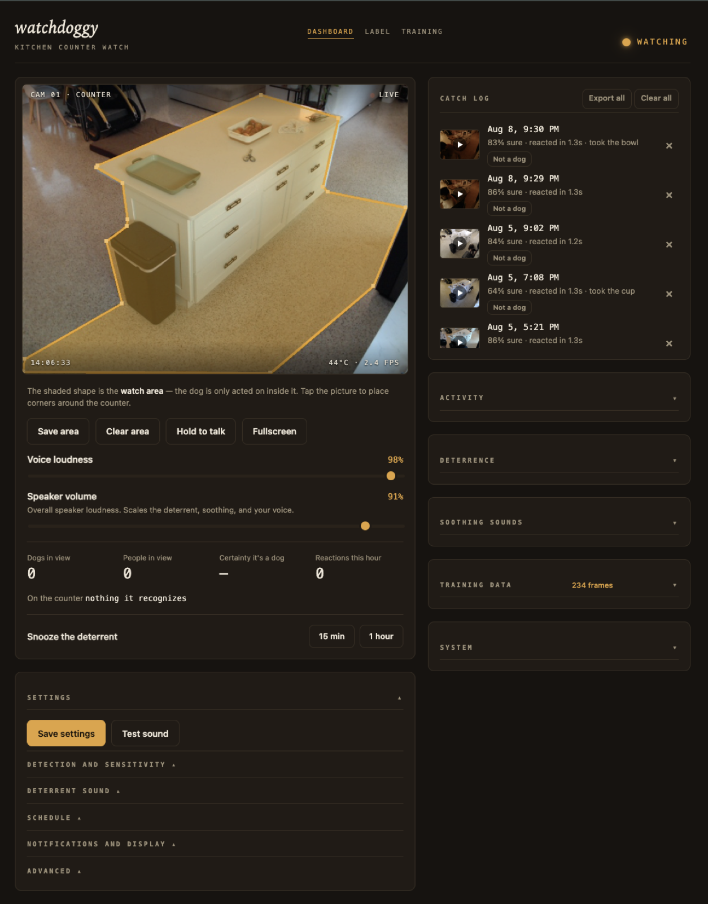

# watchdoggy

Counter Watch is a ~$62 Raspberry Pi appliance that watches your kitchen counter and plays a deterrent sound the moment the dog enters an area you draw. It ignores people and manages its own temperature. It **retrains its own vision model on the frames it captures**, so it gets better at your kitchen, your light, and your dog, week after week. It updates its own software too: tag a release on GitHub and every appliance installs it, health-checks itself, and rolls back if anything looks wrong.

Detection runs entirely on the device. The camera feed never leaves your network. The only thing that ever touches the internet, and only if you enable it, is a sandboxed trainer that sends training jobs to your own private cloud GPU account and checks GitHub for releases.



## What it does

- Detects dogs with a YOLO model running locally on the Pi's CPU (via NCNN). No cloud vision API.
- Only acts on dogs inside a watch area you draw on the live view.
- Ignores people, including the classic failure where a bent-over person reads as a "dog".
- Plays a deterrent sound through a Bluetooth or USB speaker, with cooldowns and an hourly cap.
- Keeps a catch log with a snapshot and clip of every alarm; one tap turns a false alarm into training data.
- Loops your own calm audio while it watches; the deterrent always interrupts and the music resumes on its own.
- **Trains itself**: captures its own mistakes and edge cases, auto-labels most frames with a two-model jury overnight, retrains in the cloud on a schedule, and only ships a new model if it beats the current one on a human-verified exam. The previous model is kept for instant rollback.
- **Maintains itself**: daily self-updates from GitHub releases with health checks and rollback, clock sync without NTP, state snapshots before every change, and a credit gate that stops cloud jobs when your monthly budget is spent.
- Serves a plain-language dashboard on your network: Dashboard, Label, and Training pages.

In this kitchen the loop's first day took the model from 15/61 dog moments caught with 5 false alarms (stock COCO weights) to 90%+ catch rates, measured on the exported bundle the Pi actually runs, on held-out frames it never trained on.

The details live in two documents: **[MANUAL.md](MANUAL.md)** is the owner's manual (dashboard, self-training loop, training console, self-maintenance, privacy), and **[ARCHITECTURE.md](ARCHITECTURE.md)** covers the code layout and the design patterns behind it.

## How it works

```
USB webcam -> capture thread -> YOLO (NCNN, in a dedicated inference process)
           -> watch-area filter -> person suppression -> oversize filter
           -> M-of-N + confirm-timer trigger -> safety limits (cooldown, hourly cap)
           -> deterrent sound + catch log + clip + training-frame capture
```

A FastAPI app streams the annotated view over MJPEG and exposes the live-tunable settings. A governor paces detection with CPU temperature so a fanless Pi never throttles. The training side is a job queue: the web UI or the schedule writes job files, a sandboxed `trainer` user (the only one the firewall lets online) runs them against a Modal cloud GPU and applies gated results. House rules across the codebase: no file over 200 lines, no `else` blocks, no nested loops.

## Hardware (~$62)

| Part | Price |
|---|---|
| Raspberry Pi 4 Model B | $35 |
| Aluminum heatsink case | $12 |
| 1080p USB webcam | $15 |
| Total | ~$62 |

Plus any Bluetooth or USB speaker you already have for the sound (this build uses a JBL Go), and optionally a Modal account for cloud training (a full training run costs well under two dollars).

## Quick start (dev, on a Mac)

```sh
uv sync
cp .env.example .env          # set DOGGY_CAMERA_INDEX for your webcam
uv run yolo export model=yolo26n.pt format=ncnn   # downloads yolo26n.pt
# drop at least one sound clip into sounds/
uv run doggy                  # dashboard at http://127.0.0.1:8000
```

Grant your terminal camera permission (System Settings, Privacy, Camera), or OpenCV returns empty frames with no error.

## Deploy to a Raspberry Pi

```sh
./scripts/deploy-to-pi.sh <user@host>
```

This syncs the code, installs dependencies with `uv`, downloads and NCNN-exports the model for ARM, writes a Pi `.env`, and installs a systemd service that runs on boot. After the first full deploy, day-to-day updates arrive by themselves: tag a release and the appliance takes it from there.

Optional:

- `scripts/setup-bt-speaker.sh` sets up a Bluetooth speaker with hands-free auto-reconnect (PipeWire).
- `scripts/harden-pi.sh` locks it down with a LAN-only egress firewall and key-only SSH.
- `scripts/setup-https.sh` gives the dashboard a padlock via a home CA (needed for push-to-talk and notifications).
- `scripts/setup-pi-trainer.sh` enables autonomous cloud training and self-updates: the sandboxed `trainer` user, the per-UID firewall exception, the Modal client, the root helpers, and the schedule.

## Privacy

- The detector service has no internet access, enforced by an nftables egress firewall, not by promises.
- Cloud training is opt-in and runs as a separate user; a per-UID firewall exception lets only that user online. Frames go to your own private Modal volume and nowhere else.
- Skip the trainer setup and the appliance is 100% offline; the same training pipeline runs manually from a workstation.

## Tests

```sh
uv run pytest -m "not slow"    # fast suite (~380 tests), no hardware or weights
uv run pytest -m slow          # detector test (needs the model and local photo fixtures)
```

## License

The code in this repository is MIT licensed.

Two dependency notes, stated plainly. First, the project depends on the
Ultralytics YOLO library, which is AGPL-3.0: none of its code lives in this
repository, but installing the dependencies and running the combined work
puts that combination under AGPL terms (or an Ultralytics commercial
license). Second, the YOLO26 weights and any model you fine-tune from them
inherit Ultralytics' licensing; the MIT grant here covers this project's
code, not the models it trains.
